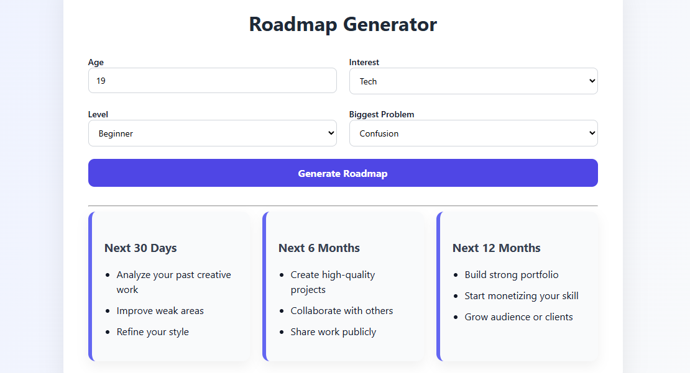

#  dashboard Roadmap Generator 

a dynamic, client-side browser dashboard home screen that instantly generates personalized 30-day, 6-month, and 12-month learning roadmaps without requiring a single full-page reload. 

mainly build for the **"Give Your Website a Pulse"** Stardance mission.

---

## HERE HOW it WORKS

1. The front-end captures user inputs (age, track, and difficulty) using native HTML forms.
2. An event listener intercepts the submission to prevent a page refresh, bundling the data into a JSON payload.
3.The data is sent via fetch() to a Python Flask backend.
4. The backend processes the variables through conditional mapping blocks to output a structured JSON schedule.
5. JavaScript parses the response and dynamically updates the DOM grid container.
---

## USED STACK while building this

* **Frontend Dashboard:** HTML5, CSS Grid/Flexbox, Native Client JavaScript
* **Backend Processing Module:** Python, Flask Engine, Flask-CORS Middleware

---

## folder and files tree

```text
├── .vscode/               # Workspace configuration files
├── backend/
│   └── app.py            # Flask API processing pipeline with CORS integrations
├── frontend/
│   ├── index.html        # Persistent dashboard interface shell
│   ├── script.js         # Fetch request interceptions and dynamic client injection
│   └── style.css         # Custom layout designs and responsive grid systems
└── README.md             # Project documentation and mission verification
```

---

## WANT it in YOUR computer 
### 1. HOW to intilize the server pipeline

nevigate it by opening the TERMINAL in your local editor and write few codes given below
```bash
cd backend
pip install requirements.txt
python app.py
```

### 2. open this inside your own browser
just make a ctrl + click on to the blue txt "http://127.0.0.1:5000" or write the below txt on your browser (make sure while its RUNNING)
```text
http://127.0.0.1:5000
```
## SCREENSHORT mine beautiful generator 

> 
